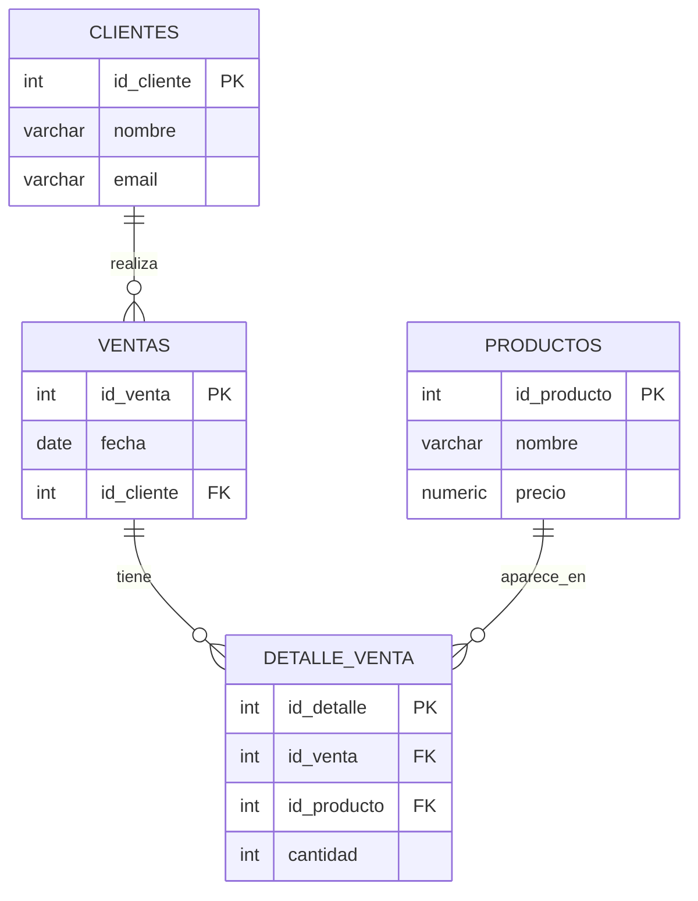

# sql-sistema-ventas

### 1. Descripción del proyecto

- Sistema modelado: un sistema de ventas simple que gestiona `clientes`, `productos`, `ventas` y `detalle_venta`.
- Problema que resuelve: permite almacenar y consultar clientes, productos y transacciones (ventas), facilitar análisis de ventas y generar reportes SQL.

### 2. Tecnologías utilizadas

- PostgreSQL
- SQL

### 3. Instrucciones de uso

Requisitos: tener PostgreSQL instalado y `psql` disponible en la terminal.

- Crear la base de datos:

```bash
psql -U postgres -c "CREATE DATABASE ventas_db;"
```

- Ejecutar el esquema (`schema.sql`):

```bash
psql -U postgres -d ventas_db -f schema.sql
```

- Cargar datos de ejemplo (`seed.sql`):

```bash
psql -U postgres -d ventas_db -f seed.sql
```

- Ejecutar el reporte/consultas (`report.sql`):

```bash
psql -U postgres -d ventas_db -f report.sql
```

### 4. Diagrama ER en Mermaid


